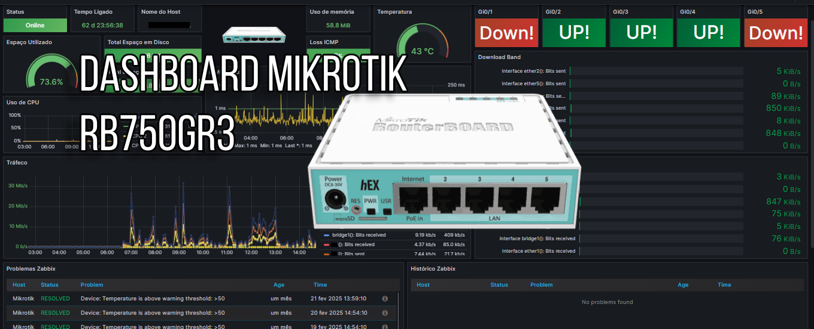
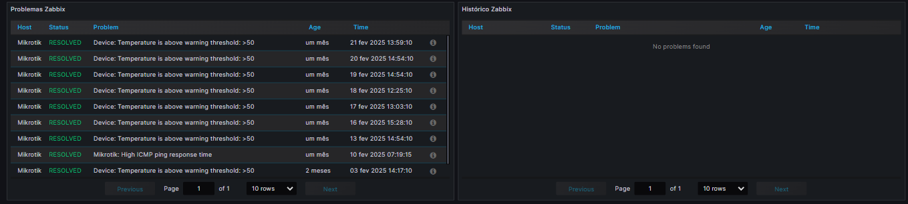
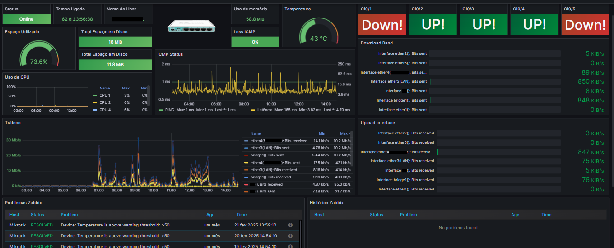

# dashboard_mikrotik_RB750GR3
Dashboard Grafana + Zabbix Router Mikrotik RB750GR3

Datasource = Zabbix

Monitoramento Mikrotik RB750Gr3 Router.

Grafana Lab = https://grafana.com/orgs/marcusronney/dashboards

Status do Dispositivo

Online/Offline

Tempo de atividade (uptime)

Recursos do Sistema

Uso de CPU (por núcleo)

Uso de memória RAM

Espaço em disco disponível

Temperatura do equipamento

Conectividade

Perda de pacotes (ICMP)

Latência da rede

Interfaces de Rede

Estado das portas (UP/DOWN)

Tráfego de upload e download por interface

Gráficos de picos de banda (em tempo real)

Alertas e Problemas (Zabbix)

Problemas ativos ou resolvidos (ex: temperatura elevada)

Histórico de incidentes monitorados

Templates = https://www.zabbix.com/integrations/mikrotik

